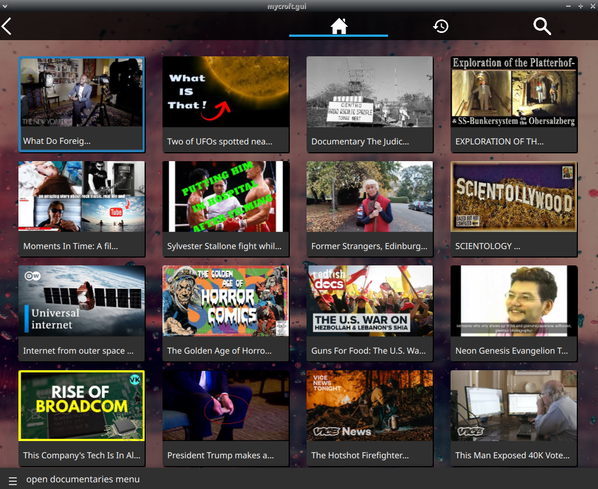

# r/DocumentariesSkill

## About 

Documentaries from r/Documentaries

## Installation Notes

this requires [skill-better-playback-control](https://github.com/JarbasSkills/skill-better-playback-control), it will blacklist and replace the official mycroft skill

## Examples 

* "open documentaries menu"
* "play a documentary"

## Credits 
- JarbasAl
- [AIIX](https://github.com/AIIX/) - GUI 
- [r/Documentaries](https://www.reddit.com/r/Documentaries/)

## Category
**Entertainment**

## Tags
#documentaries
#educational
#entertainment